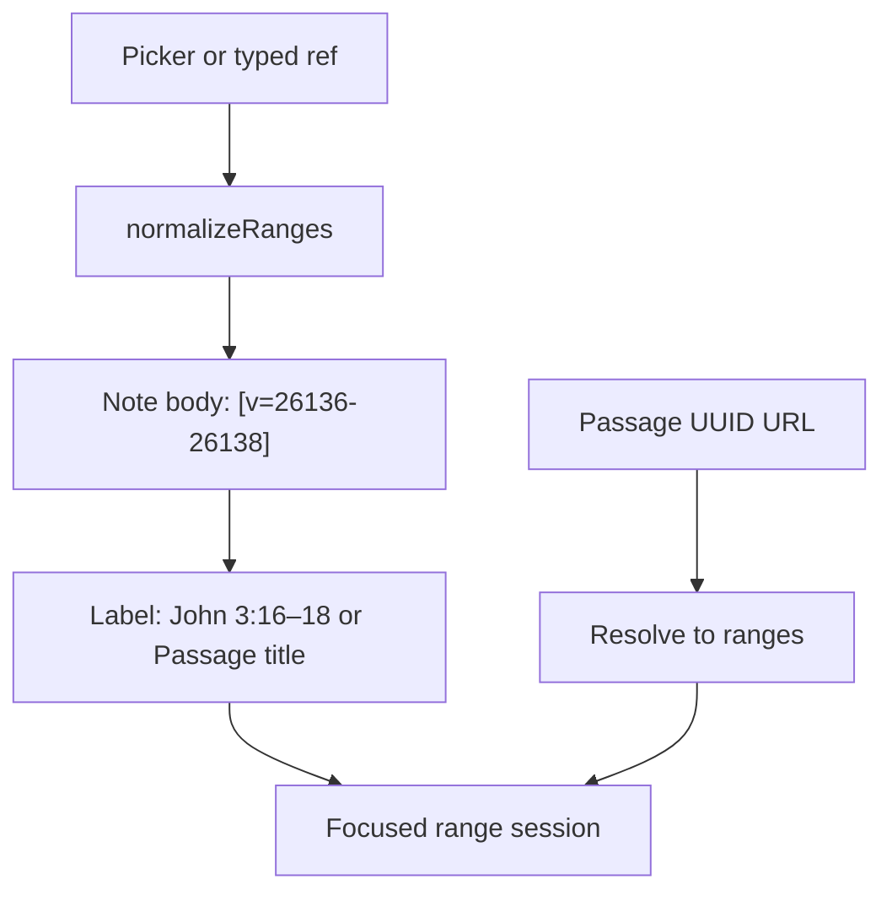

# Portable `[v=…]` verse links

**Status:** Implemented (core + scope multi-verse + absolute multi-verse) — see checklist below  
**Architecture (invariants):** [passage-and-verse-link-model.md](./passage-and-verse-link-model.md)  
**Prior slice (done):** [first-class-passages.md](./first-class-passages.md)  
**Index:** [README.md](./README.md)

## Overview

Correct note/document links to store portable `[v=…]` verse-id ranges (not Passage UUIDs), render human-readable references (or Passage titles when available), and open a focused range reader that does not require a Passage row.

**Invariant:** Links address immutable verse ids. Passages are optional named lenses. Collections group passages. Notes/exports stay portable.

## Current gap

We already have Passage catalog, collection membership, focused `/read/passage/{uuid}`, and an Insert passage picker — but inserts persist `[passage=<uuid>]`. That fails the portability rule and makes link validity depend on a DB row.

## Target behavior

| Concern | Behavior |
|---------|----------|
| Storage | `[v=26136]`, `[v=26136-26138]`, `[v=26136-26138,26140]` |
| Render label | Derived Bible reference; prefer matching Passage **title** when present |
| Click | Focused reader on those verse ids — **no Passage row required** |
| Picker insert | Always `[v=…]` from passage/range `naturalKey` |
| Typed `[John 3:16]` / `[John 3:16-18]` / scope `[12]` / `[1-11]` / `[1,5,7]` | Normalize to `[v=…]` **on save** |
| Legacy `[pid=N]` | Still opens collection; no new inserts |
| Legacy `[passage=uuid]` | Resolve to ranges for compat; no new inserts |
| `/read/passage/{uuid}` | Keep as session handle → same range reader |
| New deep link | `/read/range?v=26136-26138` for pure links |

## Implementation

### 1. Shared normalize/serialize (server + client mirror)

Add `VerseRangeParser` next to `NaturalKeyParser`:

- `parseVToken` / `normalizeRanges` / `serializeVToken` (`[v=…]`)
- `rangesFromNaturalKey` / `naturalKeyFromRanges`
- Sort segments, merge overlaps/adjacents, validate `1…31102`, `start <= end`
- Unit tests for merge, reject OOB, equality, round-trip

Optional: `GET /api/ranges/label?v=…` for `{ reference, title? }` — or derive labels via existing verse APIs. Prefer one server helper shared with Passage find-or-create.

### 2. Focused range reader (Passage optional)

Extend scoped reader in `app.js`:

- `enterRangeMode(ranges, { label?, passageId?, push })` — flatten verse ids, page-turn within range only
- `[v=…]` clicks → `enterRangeMode`
- `/read/passage/{uuid}` → fetch passage → `enterRangeMode` with title-or-ref chrome
- `/read/range?v=…` (+ WebController / SecurityConfig) for deep links; login not required to *read* the range
- Chrome: title if Passage resolved, else derived reference

v1 non-goal: discovery panels (“In collections…”).

### 3. Note insert + render + save normalize

**Insert picker** (reader + sermon): insert `serializeVToken(ranges)` — never UUID.

**Render** (`renderNoteInline` + dashboard/notes copies):

1. `[v=…]` → reference label; Passage title if normalized ranges match a catalog passage  
2. `[passage=uuid]` → resolve to ranges/label (compat)  
3. `[pid=N]` → collection (legacy)  
4. Ad-hoc human/scope forms still work until save rewrites them:
   - Absolute: `[John 3:16]`, `[John 3:16-18]`, `[John 3:1-11,15]`
   - Chapter/verse-note scope: `[12]`, `[1-11]`, `[1,5,7]`, `[1-11,15]` (pre-save → `note-range-link`)
   - Book-note scope: `[12]` / `[1-11]` chapters; `[3:16]` / `[3:1-11]` verses; mixed segments  

**On save** (verse / chapter / book / sermon):

- Scope-relative multi-verse → `[v=…]` via `ScopeRelativeLinkParser` grammar (mirrored in `app.js`); chapter uses `firstVerseId`/`verseCount`, book uses chapter metadata  
- Absolute single + same-chapter multi-verse refs → `[v=…]` via `/api/reference` (`ReferenceParser.parseAbsoluteLink`)  
- Leave markdown and existing `[v=…]` alone; do not rewrite `[pid=…]` in this slice  
- **Not yet:** cross-chapter absolute refs like `[John 3:16-4:2]`

Hints: links display as references; Insert persists portable form.

### 4. Passages & collections (role unchanged)

- Builder still create/reuses Passage entities for membership  
- Find-or-create by **normalized** ranges / `naturalKey` (normalize before lookup)  
- Memorization FK unchanged  

### 5. Tests / acceptance

- Parser: normalize/merge/serialize; naturalKey ↔ ranges  
- Insert → stored `[v=…]`; render shows `John 3:16`; click opens range reader without Passage; titled Passage upgrades label  
- Checklist from architecture §11  

## Out of scope

- Character/location studies, study plans UI  
- Discovery side panel on focused reader  
- Bulk rewrite of historical `[pid=…]` in note bodies  
- Autocomplete-in-textarea  

## Todos

1. ~~Add `VerseRangeParser` + unit tests~~  
2. ~~`enterRangeMode` + `/read/range?v=…`; passage UUID URL → same session~~  
3. ~~Picker inserts `[v=…]`; render ref/title; save-time normalize; legacy compat~~  
4. ~~Passage find-or-create uses normalized ranges~~  
5. ~~Acceptance tests / checklist~~  
6. ~~Scope-relative multi-verse input (`[1-11]`, lists, book `[3:1-11]`) + `ScopeRelativeLinkParser`~~  
7. ~~Absolute multi-verse typed refs (`[John 3:16-18]`)~~  

### Manual smoke checklist

- [ ] Insert scripture from note picker → body contains `[v=…]` not UUID  
- [ ] View note → label shows `John 3:16` (or Passage title)  
- [ ] Click link → `/read/range?v=…` focused reader works signed out  
- [ ] Typed `[John 3:16]` normalizes to `[v=…]` on save  
- [ ] Typed `[John 3:16-18]` / `[John 3:1-11,15]` normalize to multi-segment `[v=…]` on save; pre-save click opens range reader  
- [ ] Chapter note: typed `[1-11]` / `[1,5,7]` clickable before save; normalize to multi-segment `[v=…]` on save  
- [ ] Book note: typed `[1-2]` (chapters) and `[3:1-11]` normalize correctly  
- [ ] Legacy `[pid=N]` still opens collection  
- [ ] `/read/passage/{uuid}` still works  
